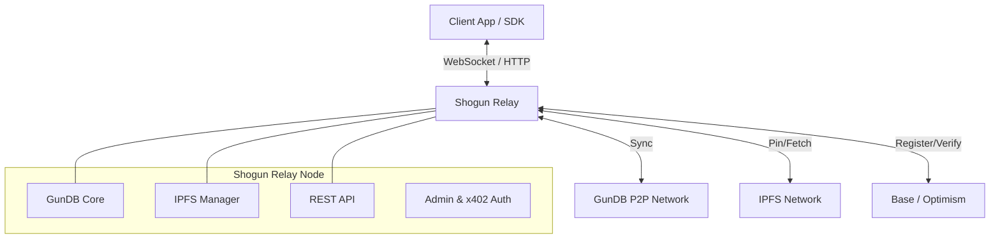

# Architecture

The Shogun Protocol architecture is designed to be modular, resilient, and decentralized.

## High-Level Overview

## Component Interaction

### 1. The Client
The client application (web, mobile, desktop) uses the **Shogun SDK** or standard HTTP/WebSocket libraries to communicate with a **Shogun Relay**.
*   **Reads/Writes**: Real-time data updates via GunDB WebSockets.
*   **Uploads**: File uploads via REST API (multipart/form-data).
*   **Payments**: Wallet interactions for x402 subscriptions or on-chain deals.

### 2. Shogun Relay
The Relay is the workhorse of the network. It is a Node.js application that bundles:
*   **GunDB Server**: Acts as a super-peer, storing graph data and relaying messages between clients.
*   **IPFS Controller**: Manages a local or remote IPFS node (Kubo). It handles pinning, unpinning, and garbage collection.
*   **API Gateway**: Exposes a unified REST API for system management, stats, and file operations.
*   **Blockchain Agent**: Monitors smart contracts for storage deals and manages on-chain registration.

### 3. Smart Contracts
Deployed on EVM-compatible chains (Base, Optimism), these contracts provide the trust layer:
*   **ShogunRelayRegistry**: A directory of all active relays, their endpoints, and their staked value.
*   **StorageDealRegistry**: Escrow contracts for storage deals. A client locks funds, and the relay claims them by proving they store the data.
*   **Stealth Contracts**: Privacy pools and payment forwarders for anonymous transactions.

## Data Flow Examples

### Storing a File
1.  **Upload**: Client uploads a file to the Relay via API.
2.  **Pin**: Relay adds the file to its local IPFS node and pins it.
3.  **Index**: Relay writes the IPFS CID and metadata (size, type, owner) to a node in GunDB.
4.  **Sync**: The GunDB update propagates to other subscribed peers/relays.

### Creating a Storage Deal
1.  **Negotiate**: Client requests a quote from a Relay (off-chain or on-chain pricing).
2.  **Lock**: Client calls `StorageDealRegistry.createDeal()` on-chain, locking USDC.
3.  **Store**: Relay detects the event, pins the content, and begins the storage period.
4.  **Verify**: Relay periodically submits proofs (or simply maintains availability) to claim payments or avoid slashing (depending on the specific verification mechanism used).
